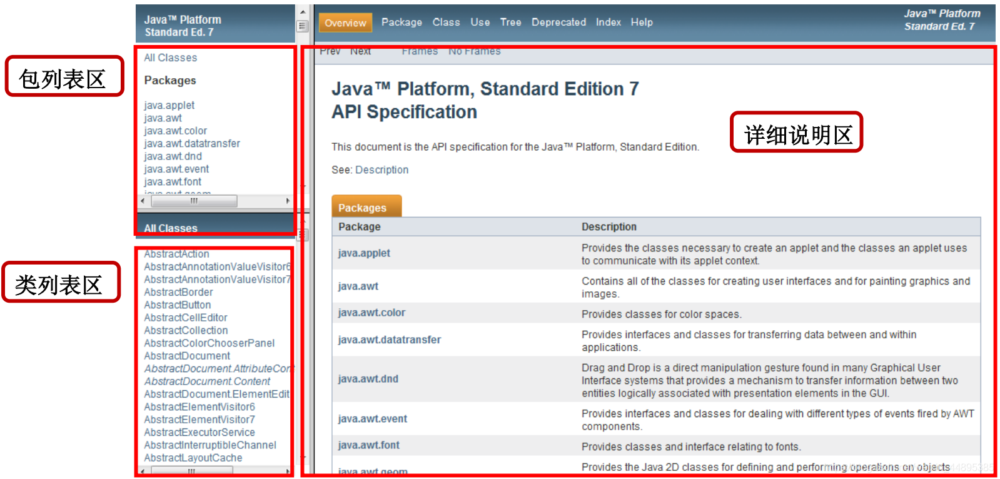

## Java的开发步骤

1. 将 Java 代码编写到扩展名为 .java 的文件中。
2. 通过 `javac` 命令对该 java 文件进行编译。
3. 通过 `java` 命令对生成的 class 文件进行运行。


## HelloWorld

```java
public class FirstSample {
    public static void main(String[] args) {
        System.out.println("Hello, World!"); 
    }
}
```

* Java 区分大小写。 如果出现了大小写拼写错误（例如，将 main 拼写成 Main)，程序将无法运行。
* 关键字 public 称为访问修饰符（access modifier)。用于控制程序的其他部分对这段代码的访问级别。一个源文件中最多只能有一个public类。其它类的个数不限，如果源文件包含 一个public类，则文件名必须按该类名命名。
* class 表明 Java 程序中的全部内容都包含在类中。这里只需要将类作为一个加载程序逻辑的容器，程序逻辑定义了应用程序的行为。
* class 后面紧跟类名。名字必须以字母开头，后面可以跟字母和数字的任意组合。长度基本没有限制，不能使用 Java 保留字。

> 标准的命名规范：类名是以大写字母开头的名词。如果名字由多个单词组成，每个单词的第一个字母都应该大写（在一个单词中间使用大写字母的方式称为骆驼命名法)。

* 源代码的文件名必须与公共类的名字相同，并用 .java 作为扩展名。因此，存储这段源代码的文件名必须为 FirstSample.java。
* 在编译这段源代码之后就会得到一个包含这个类字节码的文件。Java 编译器将字节码文件自动地命名为 FirstSample. class, 并与源文件存储在同一个目录下。
* 运行已编译的程序时，Java 虚拟机将从指定类中的 main 方法开始执行（这里的“方法”就是 Java 中所说的“函数”），在类的源文件中必须包含一个 main方法。也可以将自定义的方法添加到类中，并且在 main 方法中调用它们。
* 用大括号划分程序的各个部分（通常称为块)。Java 中任何方法的代码都用“ `{` ” 开始，用“ `}` ”结束。
* 每个 Java 应用程序都必须有一个 main 方法，其声明格式如下所示：


```java
public class ClassName {
    public static void main(String[] args) {
        // 程序语句
    }
}
```

每个句子必须用分号结束。回车不是语句的结束标志，所以可以将一条语句写在多行上。

`System.out` 对象调用了它的 println 方法。点号（`.`）用于调用方法。

Java 使用的通用语法是：`object.method (parameters)`


## Java API文档

API （Application Programming Interface,应用程序编程接口）是 Java 提供的基本编程接口。

Java语言提供了大量的基础类，因此 Oracle 也为这些基础类提供了相应的API文档，用于告诉开发者如何使用这些类，以及这些类里包含的方法。

[https://www.oracle.com/java/technologies/javase-jdk8-doc-downloads.html](https://www.oracle.com/java/technologies/javase-jdk8-doc-downloads.html)


